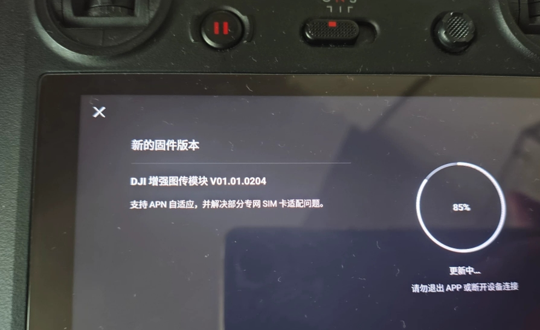

# V01.01.0204 固件更新说明

目标固件：`QDC507GLEFM21_01.001.02.004`，对应设备界面版本 `V01.01.0204`。

## 设备界面显示的更新内容

> DJI 增强图传模块 V01.01.0204  
> 支持 APN 自适应，并解决部分专网 SIM 卡适配问题。

图片引用自 White-Alone 的 [《大疆4G模组和闲鱼伪基站二三事》](https://blog.white-alone.com/posts/%E5%A4%A7%E7%96%864G%E6%A8%A1%E7%BB%84%E5%92%8C%E9%97%B2%E9%B1%BC%E4%BC%AA%E5%9F%BA%E7%AB%99%E4%BA%8C%E4%B8%89%E4%BA%8B) 中的“遥控器升级固件”配图（[原图](https://raw.githubusercontent.com/white-alone/blog_img/master/%E5%A4%A7%E7%96%864G%E6%A8%A1%E7%BB%84%E5%92%8C%E9%97%B2%E9%B1%BC%E4%BC%AA%E5%9F%BA%E7%AB%99%E4%BA%8C%E4%B8%89%E4%BA%8B/1785307347818.png)）。图片不是本项目拍摄，版权归原作者及相应权利人。

APN 是蜂窝数据连接使用的接入点名称。这段设备界面说明表明更新涉及 APN 适配与部分专网 SIM 的兼容性，没有提供具体 APN 选择算法或适配卡种清单。

## 如何理解这份说明

- 不能据此保证所有运营商卡都自动识别，或无需配置即可接入任意专网。
- 说明没有提及 MBIM USB 控制握手修复或下载速度提升。
- 照片没有显示固件发布日期；原文日期也不等于固件发布日期。
- 图中的 85% 是照片中的更新进度，不是本工具的升级验证结果。
- 工具是否升级成功，应以分区回读、全盘比对和复位后设备检查为准。

这是原文照片中可见的更新说明，不是完整厂商更新日志，也不表示该版本始终是官方最新版本。来源、图片处理及哈希见 [来源记录](SOURCES.md) 和 [证据 JSON](evidence/dji-v01.01.0204-release-notes.json)。
